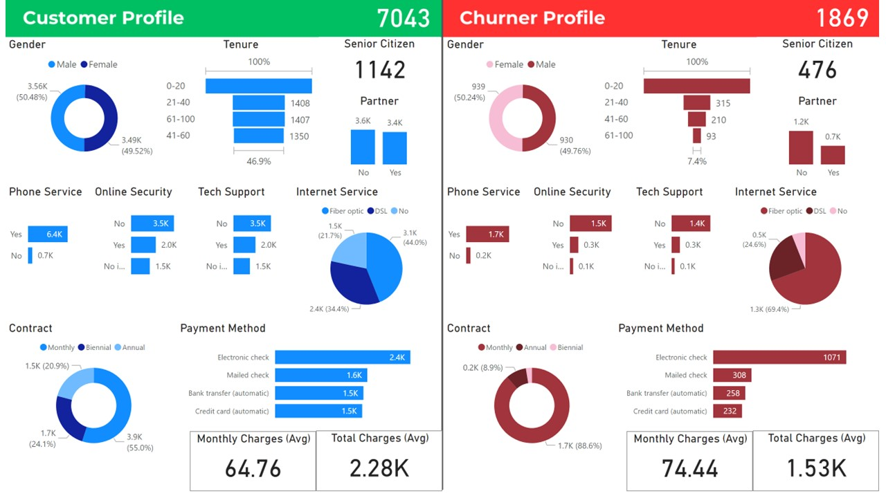

# Customer Churn ETL Pipeline with AWS, Apache Airflow, and PowerBI

This repository showcases a data pipeline designed for customer churn analysis. The pipeline integrates various AWS services like Amazon S3, AWS Glue, Amazon Redshift, and Athena, with orchestration handled by Apache Airflow. Data visualization is achieved through Power BI.

## Architecture Diagram

Below is the architecture diagram for the Customer Churn ETL Pipeline:

## Dashboard

Here is a screenshot of the dashboard created with Power BI:

## Architecture Overview

### Key Components:
- **Amazon S3**: Acts as both the data source and target for raw and processed data storage.
- **AWS Glue Crawler**: Automatically infers the schema of data in S3 and Redshift, and updates the AWS Glue Data Catalog for querying with Amazon Athena or Amazon Redshift.
- **AWS Glue Job**: Responsible for transforming the data and moving it from S3 to Redshift.
- **Amazon Redshift**: A data warehouse for storing and analyzing transformed data.
- **Amazon Athena**: Enables querying of S3 data using SQL for analytics.
- **Apache Airflow**: Orchestrates the ETL process, ensuring seamless data flow.
- **Power BI**: Used for building dashboards and reports for customer churn insights.

### Data Pipeline Flow

1. **Data Collection and Storage**:
   - The customer churn dataset is uploaded to an **Amazon S3** bucket.

2. **Schema Inference with AWS Glue**:
   - **AWS Glue Crawlers** infer the schema for both the raw data in S3 and the transformed data in Redshift, registering the information in the **AWS Glue Data Catalog**.

3. **Data Transformation using AWS Glue Job**:
   - The data is processed and transformed using an **AWS Glue Job** before being loaded into **Amazon Redshift** for further analysis.

4. **Data Analytics using Athena and Redshift**:
   - Users can query raw data in S3 using **Amazon Athena**, or transformed data in **Amazon Redshift**.

5. **Visualization in Power BI**:
   - The processed data is visualized in **Power BI**, offering insights into customer churn through dynamic dashboards.

## Airflow DAG: `customer-churn-dag.py`

This Apache Airflow DAG orchestrates the Glue job execution for transferring data from **Amazon S3** to **Amazon Redshift**. Key tasks include:

- **Trigger Glue Job**: Uses a PythonOperator to initiate the AWS Glue job.
- **Fetch Glue Job Run ID**: Retrieves the Glue job run ID to monitor its progress.
- **Monitor Glue Job Execution**: A **GlueJobSensor** monitors the job until completion.

